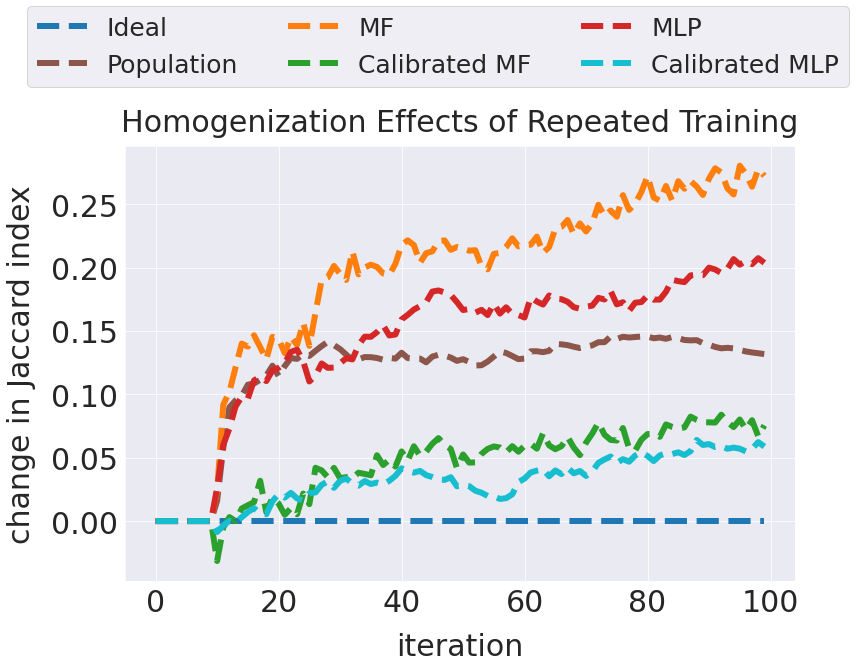
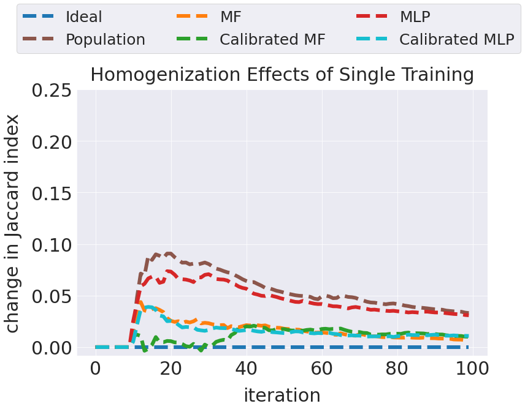
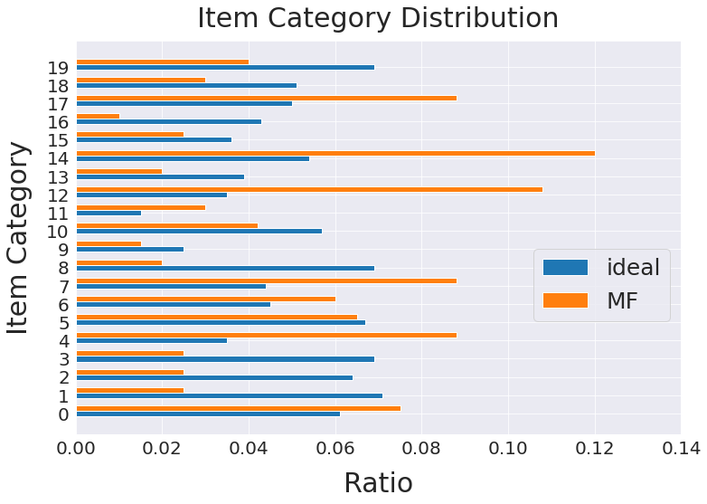
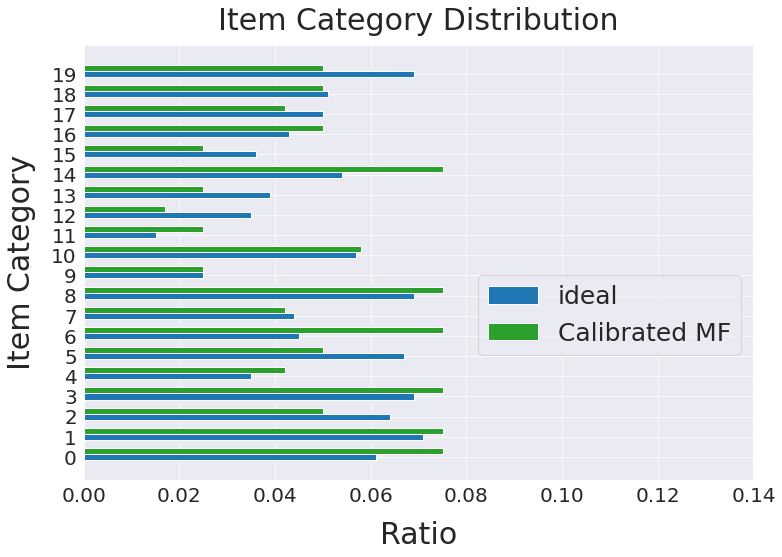
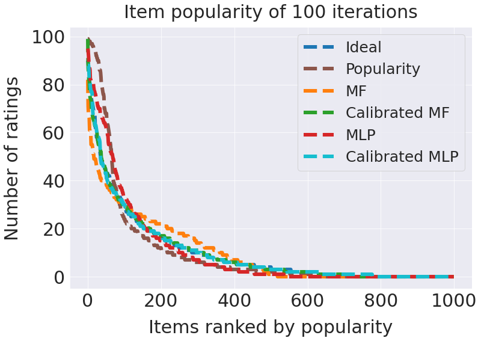

# Group 12 
# Requirements
### 1. Python version
Python3
### 2.Install Pytorch
https://pytorch.org/

### 3.Install Jupyter Notebook
```
pip install jupyter
```

# How to run?
### Repeated Training Simulation
```
jupyter notebook Simulation.ipynb
```

### Single Training Simulation
modify one line in Simulation.ipynb : set the ```single_train``` variable to True, then run the jupyter notebook again

# Result (Most of results are from Repeated Training)


## 1.Homogenization Effect
### **Repeated Training**

### **Single Training**



## 2.Calibrated Recommendation (**Repeated Training**)
### Without Calibration

### With Calibration



## 3.Item Popularity (**Repeated Training**)


# References
[1] How algorithmic confounding in recommendation systems increases homogeneity and decreases utility (RecSys '18) DOI:https://doi.org/10.1145/3240323.3240370

[2] Calibrated recommendations (RecSys '18) DOI: https://doi.org/10.1145/3240323.3240372

[3] Neural Collaborative Filtering WWW '17: Proceedings of the 26th International Conference on World Wide WebApril 2017 Pages 173–182https://doi.org/10.1145/3038912.3052569

[4] Matrix Factorization Library : https://github.com/benfred/implicit

[5] Neural Collaborative Filtering Code: https://github.com/yihong-chen/neural-collaborative-filtering

[6] Calibrated Recommendations Tutorial: https://github.com/ethen8181/machine-learning

[7] Advances in Bias-aware Recommendation on the Web: https://github.com/biasinrecsys/wsdm2021