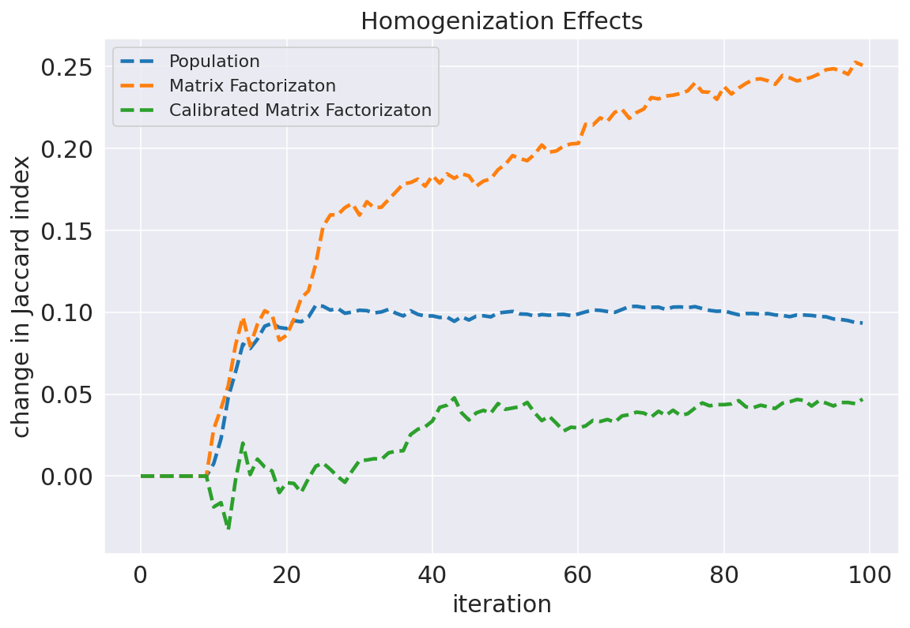
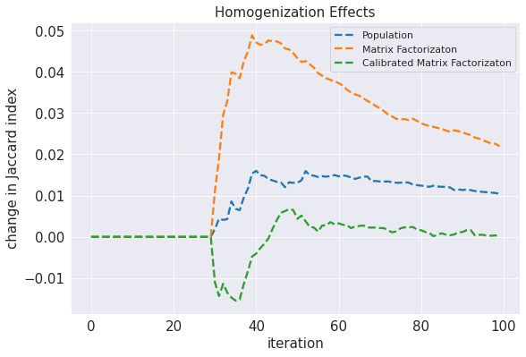
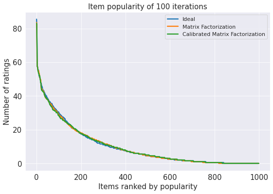
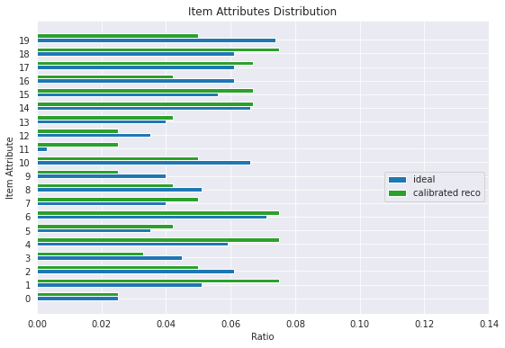

## Team 12 

# Method : User Modeling

## Run
```
jupyter notebook Simulation.ipynb
```

## Result
### Jaccard(Multiple & Single train)
#### multiple

#### single


### Popularity


### Item Distribution
#### Without Calibration

#### With Calibration


---
## (Deprecated)CTR
## Run
### Matching Model


### CTR
#### Step0: Install tensorflow2.0
```
pip install --upgrade pip
pip install tensorflow
pip install tqdm
pip install pandas
```
#### Step1: Download Dataset

*   Amazon(Electronics)
```
mkdir raw_data
cd preprocess
sh 0_download_raw.sh
```

*   Movielens20M & 1M
```
mkdir movielens_prerocess
cd movielens_prerocess
wget https://files.grouplens.org/datasets/movielens/ml-20m.zip
wget https://files.grouplens.org/datasets/movielens/ml-1m.zip
unzip ml-20m.zip
unzip ml-1m.zip
```

#### Step2 : Preprocess dataset
```
cd preprocess
python 1_convert_pd.py
python 2_remap_id.py
```

#### Step3 : Train the model
```
python train.py
```

---

## Result
### Movielens1M Dataset (by. fengyu)
Movielens数据集数据，最測試集的结果为：`AUC：0.897757`


### Amazon-Electronic Dataset
采用Amazon-Electronic数据集数据，最终测试集的结果为：`AUC：0.857738`

### Movielens20M Dataset (by. fengyu)


Movielens数据集数据，最測試集的结果为：`AUC：0.718691`
